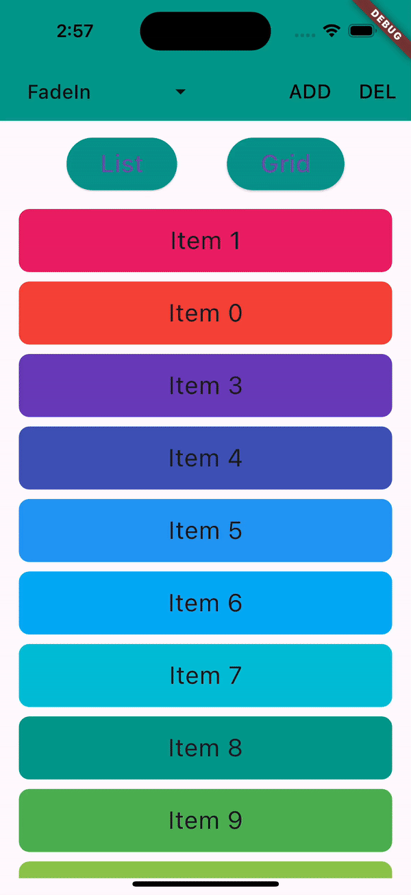
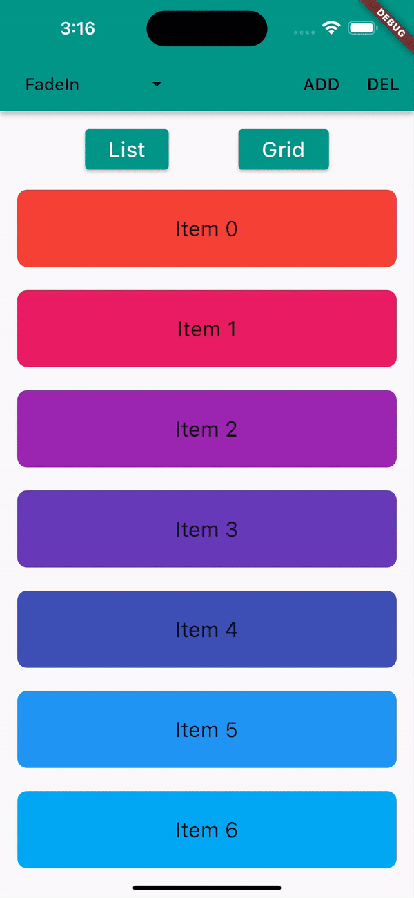
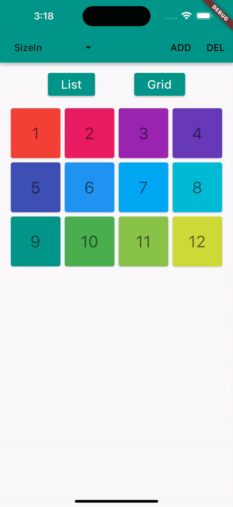
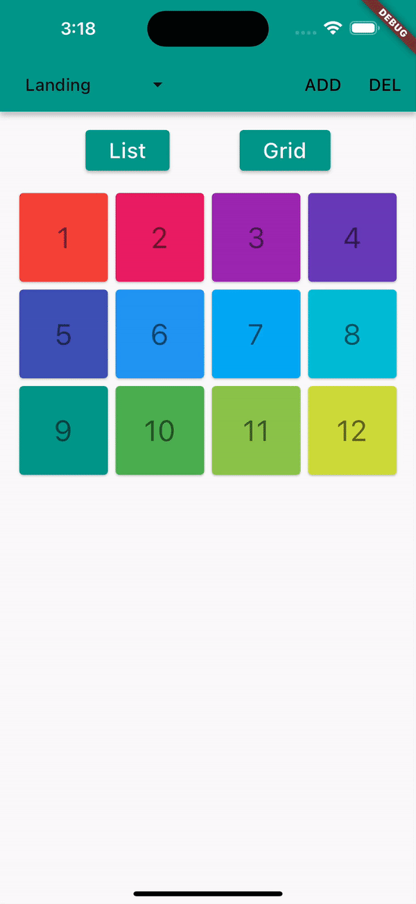

# animated_reorderable_list

A Flutter Reorderable Animated List with simple implementation and smooth transition with fully
custom animations.

## Features

- [x] Smooth transition when adding and removing items from the list with animations.
- [x] Drag and Drop support (ReorderableList) for both ListView and GridView with Animation.
- [x] Pre-built animation like fade,scale, slide, flip etc for Flutter list.
- [x] List and Grid support.
- [x] Supports large lists (thousands of items) without any issues

## Demo

### Reorderable List

 

### List Animations

  

### Grid Animations

 

_Above: The included example app._

## How to use it?

[Sample](https://github.com/canopas/animated_reorderable_list/tree/main/example) app demonstrates
how simple the usage of the library actually is.

The package contains:

Two **AnimatedList** -  `AnimatedListView` and `AnimatedGridView` for animations for item insertion
and removal with fully customizations.

Two **AnimatedReorderableList** - `AnimatedReorderableListView` and `AnimatedReorderableGridView`
adds reordering support to its items in above list.

----------------------------------------------------------------------

In the pubspec.yaml of your flutter project, add the following dependency:

```
dependencies:
  animated_reorderable_list: <latest_version>
```

----------------------------------------------------------------------


In your library add the following import:

```
import 'package:animated_reorderable_list/animated_reorderable_list.dart';

```
----------------------------------------------------------------------


## Basic usage

AnimatedReorderableGridView
---------------------------------------------------------

```dart
          AnimatedReorderableGridView(
                        items: list,
                        scrollDirection: Axis.vertical,
                        itemBuilder: (BuildContext context, int index) {
                          return ItemCard(
                              key: Key(list[index].name),
                              index: list[index].index);
                        },
                        sliverGridDelegate:
                            const SliverGridDelegateWithFixedCrossAxisCount(
                                crossAxisCount: 4),
                        enterTransition: [FadeIn(), ScaleIn()],
                        exitTransition:  [SlideIn()],
                        insertDuration: const Duration(milliseconds: 300),
                        removeDuration: const Duration(milliseconds: 300),
                        onReorder: (int oldIndex, int newIndex) {
                          setState(() {
                            final User user = list.removeAt(oldIndex);
                            list.insert(newIndex, user);
                          });
                        },
                      )

```

AnimatedReorderableListView
---------------------------------------------------------

```dart
 AnimatedReorderableListView(
                        items: list,
                        itemBuilder: (BuildContext context, int index) {
                          return ItemTile(
                              key: Key(list[index].name),
                              index: list[index].index);
                        },
                        enterTransition: [FlipInX(), ScaleIn()],,
                        exitTransition: [SlideInLeft()]
                        insertDuration: const Duration(milliseconds: 300),
                        removeDuration: const Duration(milliseconds: 300),
                        onReorder: (int oldIndex, int newIndex) {
                          setState(() {
                            final User user = list.removeAt(oldIndex);
                            list.insert(newIndex, user);
                          });
                        },
                       ),

```

AnimatedListView
---------------------------------------------------------

```dart
              AnimatedListView(
                        items: list,
                        itemBuilder: (BuildContext context, int index) {
                          return ItemTile(
                              key: Key(list[index].name),
                              index: list[index].index);
                        },
                        enterTransition: [FadeIn(), ScaleIn()],
                        exitTransition:  [SlideIn()],
                        insertDuration: const Duration(milliseconds: 300),
                        removeDuration: const Duration(milliseconds: 300),
                      ),

```

AnimatedGridView
---------------------------------------------------------

```dart
                AnimatedGridView(
                        items: list,
                        scrollDirection: Axis.vertical,
                        itemBuilder: (BuildContext context, int index) {
                          return ItemCard(
                              key: Key(list[index].name),
                              index: list[index].index);
                        },
                        sliverGridDelegate:
                            const SliverGridDelegateWithFixedCrossAxisCount(
                                crossAxisCount: 4),
                        enterTransition: [FadeIn(), ScaleIn()],
                        exitTransition:  [SlideIn()],
                        insertDuration: const Duration(milliseconds: 300),
                        removeDuration: const Duration(milliseconds: 300),
                      )
```

Basics
=================================================================================================
To apply animation, while inserting or removing item, specify a list of animation:

``` dart
    enterTransition: [FadeIn(), ScaleIn()],
    exitTransition:  [SlideIn()],
```
If not specified, then default `FadeIn()` animation will be applied.

Delay, duration, curve
----------------------------------------

Animation have optional `delay`, `duration`, and `curve` parameters. Animations run
in parallel, but you can use a `delay` to run them sequentially:

``` dart
                    enterTransition: [
                       FadeIn(
                              duration: const Duration(milliseconds: 300),
                              delay: const Duration(milliseconds: 100)),
                          ScaleIn(
                              duration: const Duration(milliseconds: 500),
                              curve: Curves.bounceInOut)
                        ],
```

If a specific duration is provided for the animation, it will run for that specified duration. However, if both `insertDuration` and `removeDuration` are specified, the animation will run for the specified `insertDuration` and `removeDuration`. 
If both are not specified, the default duration for the animation will be set to `Duration(milliseconds: 300)`.

Custom AnimationBuilder
----------------------------------------
``` dart
                        insertItemBuilder: (Widget child, Animation<double> animation){
                                 return ScaleTransition(
                                       scale: animation,
                                       child: child,
                                     );
                                    },
                                    
                        removeItemBuilder: (Widget child, Animation<double> animation){
                                     return ScaleTransition(
                                       scale: animation,
                                       child: child,
                                     );
                                    },
```
If you don't want to use built in built-in animation, then you can add custom `insertItemBuilder` and `removeItemBuilder` where child is the widget that is return by `itemBuilder` callback.
If a custom `insertItemBuilder` is provided, it will override the `enterTransition` and if `removeItemBuilder` is provided, then it will override `exitTransition`.


## Bugs and Feedback

For bugs, questions and discussions please use
the [Github Issues](https://github.com/canopas/animated_reorderable_list/issues).

## Credits

**animated_reorderable_list** is owned and maintained by the [Canopas team](https://canopas.com/).
You can follow them on Twitter at [@canopassoftware](https://twitter.com/canopassoftware) for
project updates and releases.

Inspired by [recyclerview-animators](https://github.com/wasabeef/recyclerview-animators) in Android.


