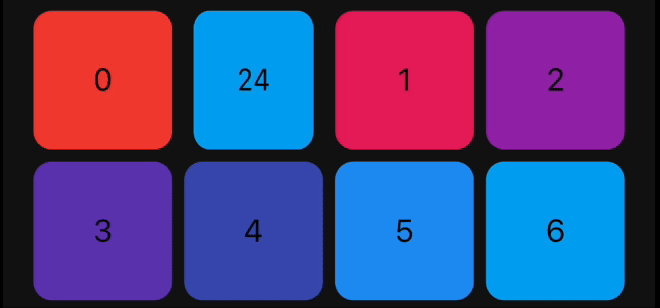
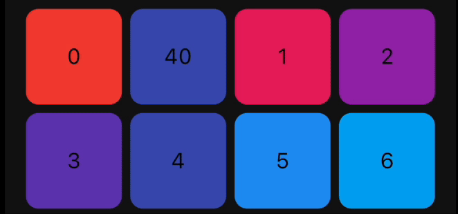

<a href="https://canopas.com/contact"></a></p>

# animated_reorderable_list

This library is a powerful and easy-to-use solution for implementing animated list and grid with
drag-and-drop functionality in Flutter.

## Features

- [x] Smooth transition during item insertion and removal from the list with animations.
- [x] Drag and Drop support (ReorderableList) for both ListView and GridView with Animation.
- [x] It can be both animated and reordered at the same time
- [x] Animating items is as simple as updating the list.
- [x] Pre-built animation like fade,scale, slide, flip etc for Flutter list.
- [x] Provides support for both lists and grids
- [x] Supports large lists and creates items on demand as they come into the viewport.
- [x] Enable/disable drag and drop functionality.
- [x] Control reordering of item / locked an item.

## Demo

### Reorderable List

|  |  |  |
|:------------------------------------------------:|:------------------------------------------------:|:-------------------------------------------------:|
|               ReorderableGridView                |               ReorderableListView                |                  Swap Animation                   | 

## How to use it?

#### 1. Add dependency

Add this to your package's `pubspec.yaml` file:

```yaml
dependencies:
  animated_reorderable_list: <latest_version>
```

#### 2. Install it

You can install packages from the command line:

with `pub`:

```
$ pub get
```

with `Flutter`:

```
$ flutter pub get
```

#### 3. Import it

Now in your `Dart` code, you can use:

```dart
import 'package:animated_reorderable_list/animated_reorderable_list.dart';
```

### 4. Use it

[Sample](https://github.com/canopas/animated_reorderable_list/tree/main/example) app demonstrates
how simple the usage of the library actually is.

## Basic usage

#### AnimatedReorderableGridView

A `AnimatedGridView` with built-in support for drag and drop functionality.

```dart
AnimatedReorderableGridView(
  items: list,
  itemBuilder: (BuildContext context, int index) {
    final user = list[index];
    return ItemCard(
      key: ValueKey(user.id),
      id: user.id,
    );
  },
  sliverGridDelegate:
      SliverReorderableGridDelegateWithFixedCrossAxisCount(
          crossAxisCount: 4),
  enterTransition: [FlipInX(), ScaleIn()],
  exitTransition: [SlideInLeft()],
  insertDuration: const Duration(milliseconds: 300),
  removeDuration: const Duration(milliseconds: 300),
  onReorder: (int oldIndex, int newIndex) {
    setState(() {
      final User user = list.removeAt(oldIndex);
      list.insert(newIndex, user);
    });
  },
  dragStartDelay: const Duration(milliseconds: 300),
  isSameItem: (a, b) => a.id == b.id,
)
```

### AnimatedReorderableListView

A `AnimatedListView` with built-in support for drag-and-drop functionality.

```dart
 AnimatedReorderableListView(
  items: list,
  itemBuilder: (BuildContext context, int index) {
    final user = list[index];
    return ItemTile(
      key: ValueKey(user.id),
      id: user.id,
    );
  },
  enterTransition: [SlideInDown()],
  exitTransition: [SlideInUp()],
  insertDuration: const Duration(milliseconds: 300),
  removeDuration: const Duration(milliseconds: 300),
  dragStartDelay: const Duration(milliseconds: 300),
  onReorder: (int oldIndex, int newIndex) {
    setState(() {
      final User user = list.removeAt(oldIndex);
      list.insert(newIndex, user);
    });
  },
  isSameItem: (a, b) => a.id == b.id
)

```

### AnimatedListView

A `AnimatedListView` that animates insertion and removal of the item. Use this widget when you don't
need drag-and-drop functionality.

```dart
AnimatedListView(
  items: list,
  itemBuilder: (context, index) {
    final user = list[index];
    return ItemTile(
      key: ValueKey(user.id),
      id: user.id,
    );
  },
  enterTransition: [FadeIn(), ScaleIn()]
  exitTransition: [SlideInUp()],
  isSameItem: (a, b) => a.id == b.id,
)
```

### AnimatedGridView

A `AnimatedGridView` that animates insertion and removal of the item. Use this widget when you don't
need drag-and-drop functionality.

```dart
AnimatedGridView(
  items: list,
  itemBuilder: (context, index) {
    final user = list[index];
    return ItemCard(
      key: ValueKey(user.id),
      id: user.id,
    );
  },
  sliverGridDelegate:
      SliverReorderableGridDelegateWithFixedCrossAxisCount(
          crossAxisCount: 4),
  enterTransition: [FadeIn(), ScaleIn()],
  exitTransition: [SlideInDown()],
  isSameItem: (a, b) => a.id == b.id),
```

Duration for animation
----------------------------------------

```dart
//optional
insertDuration: const Duration(milliseconds: 300),
removeDuration: const Duration(milliseconds:300),
```

The duration for item insertion and removal animation. If not specified, the default duration is
`Duration(milliseconds: 300)`.

Enter and exit Animation
----------------------------------------

To apply animation, while inserting or removing item, specify a list of animation:

``` dart
//optional
    enterTransition: [FadeIn(), ScaleIn()],
    exitTransition:  [SlideIn()],
```

If not specified, then default `FadeIn()` animation will be applied.

Delay, duration, curve
----------------------------------------

Animation have optional `delay`, `duration`, `begin`, `end` and `curve` parameters. Animations run
in parallel, but you can use a `delay` to run them sequentially:

``` dart
//optional
 enterTransition: [
     FadeIn(
        duration: const Duration(milliseconds: 300),
        delay: const Duration(milliseconds: 100)),
     ScaleIn(
        duration: const Duration(milliseconds: 500),
        curve: Curves.bounceInOut)
    ],
```

If a specific duration is provided for the animation, it will run for that specified duration.
However, if `insertDuration` or `removeDuration` are specified, it will override specific item
duration.

Custom AnimationBuilder
----------------------------------------

``` dart
//optional
insertItemBuilder: (Widget child, Animation<double> animation){
      return ScaleTransition(
         scale: animation,
         child: child,
     );
  }
                                    
removeItemBuilder: (Widget child, Animation<double> animation){
       return ScaleTransition(
          scale: animation,
          child: child,
      );
    }
```

You can use custom `insertItemBuilder` or `removeItemBuilder` if you wish to implement your own
customized animations instead of relying on the built-in animations provided by the library.
In these custom builder functions, the child parameter represents the widget returned by the
`itemBuilder` callback, and the `animation` parameter provides the animation control.

If a custom `insertItemBuilder` is provided, it will override the `enterTransition`. Similarly, if
`removeItemBuilder` is provided, then it will override `exitTransition`.

## Animations

The library provides a set of pre-built animations that can be used for item insertion and removal.
You can use multiple animations at the same time by providing a list of animations.

The following animations are available:

| Animation Type    | ListView Example                                                   | GridView Example                                                   |
|-------------------|--------------------------------------------------------------------|--------------------------------------------------------------------|
| **FadeIn**        |          |          |
| **FlipInY**       |        |        |
| **FlipInX**       |        |        |
| **Landing**       |          |          |
| **ScaleIn**       |         |         |
| **ScaleInTop**    |     |     |
| **ScaleInBottom** |  |  |
| **ScaleInLeft**   |    |    |
| **ScaleInRight**  |   |   |
| **Size**          |             |             |
| **SlideInLeft**   |    |    |
| **SlideInRight**  |   |   |
| **SlideInDown**   |    |    |
| **SlideInUp**     |      |      |


## Bugs and Feedback

We welcome and appreciate any suggestions you may have for improvement.
For bugs, questions, and discussions please use
the [Github Issues](https://github.com/canopas/animated_reorderable_list/issues).

<a href="https://canopas.com/contact"></a>

## Acknowledgments

This library builds upon the foundation laid by the incredible work of the Flutter team.
The core logic for animated list and drag-and-drop functionality are derived from Flutter's native
widgets, specifically `AnimatedList` and `ReorderableListView`.

## Contribution

The Canopas team enthusiastically welcomes contributions and project participation! There are a
bunch of things you can do if you want to contribute! The [Contributor Guide](CONTRIBUTING.md) has
all the information you need for everything from reporting bugs to contributing entire new features.
Please don't hesitate to jump in if you'd like to, or even ask us questions if something isn't
clear.

## Credits

**animated_reorderable_list** is owned and maintained by the [Canopas team](https://canopas.com/).
You can follow them on Twitter at [@canopassoftware](https://x.com/canopassoftware) for
project updates and releases.

Inspired by [recyclerview-animators](https://github.com/wasabeef/recyclerview-animators) in Android.
